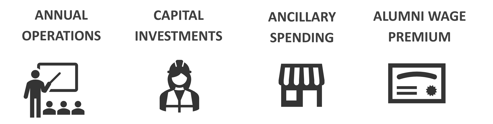
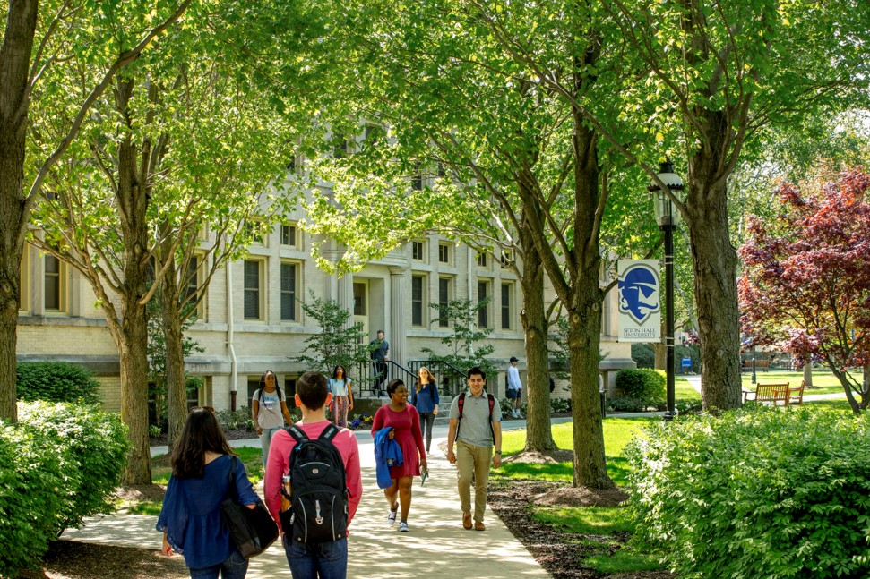

```{r libraries, echo=FALSE,message=FALSE, warning=FALSE, results='hide'}

library(knitr)
library(rmarkdown)

```

```{r app, eval=TRUE, echo=FALSE, message=FALSE, warning=FALSE}

knitr::include_app("https://xinyiqiu.shinyapps.io/UDC_EconomicImpact/", height= "1200px")

```

## 1. Introduction

### 1.1 Purpose of Report

This report describes the economic and social impact of Seton Hall University at a local, regional, and societal level. Institutions of higher education find themselves with extraordinary opportunities for producing positive change even as they face rising fiscal challenges and heightened scrutiny. This crossroads reflects long-term shifts in population demographics and economic structure and has been exacerbated by the COVID-19 pandemic. In response, institutions like Seton Hall must meet this moment, which includes articulating its impact now and recommitting itself to sustained societal contribution going forward.

Seton Hall’s impact comes from its operating footprint and capital spending, which stimulate the local economy today and creates the space for additional contribution. Seton Hall also produces impact by drawing students and visitors (and their spending) into the area, and by educating students whose discretionary spending, occupational contributions, and civic leadership produce local and societal benefit. As a faith-based and values-led institution, Seton Hall benefits society through scholarship and service, acts as a national economic engine, and is a good neighbor to the community of which it is a part.

### 1.2 About Seton Hall University

As one of the country’s leading Catholic universities, Seton Hall has been developing students in mind, heart, and spirit since 1856. Home to over 10,000 undergraduate and graduate students and offering more than 90 rigorous majors, Seton Hall’s academic excellence has been singled out for distinction by The Princeton Review, U.S. News & World Report and Bloomberg Businessweek.

Seton Hall’s 58-acre main campus is located in the quaint town of South Orange Village, New Jersey, only 14 miles from Manhattan. The University’s nationally ranked School of Law is located in nearby Newark, N.J. The new Interprofessional Health Sciences (IHS) campus is situated in the towns of Clifton and Nutley, N.J., opened in July 2018. The IHS campus houses Seton Hall’s College of Nursing, School of Health and Medical Sciences and the new Hackensack Meridian School of Medicine. 


### 1.3 An Economic Engine

Institutions of higher education, especially faith-based and values-led ones like Seton Hall, are not always immediately thought of as major regional economic engines, but they are. As an anchor institution that draws people and resources from all over the world, Seton Hall plays an important part in its regional economy. It is tethered to its specific locations, its wellbeing as an institution inextricably tied to the wellbeing of the communities around it, therefore compelling thorough and sustained investment that engages with and provides benefit to those surrounding communities. And, it represents a critical magnet for human and financial capital – in the form of a global student body, world-class faculty and researchers, and academic and athletic events that draw visitors into the region – which supports local jobs and grows the local tax base.
Seton Hall University’s specific economic contributions come from four distinct categories:



Seton Hall University’s specific economic contributions come from four distinct categories:

1. Seton Hall’s annual operations, which make Seton Hall one of the region’s largest employers and procurers of goods and services.
2. Seton Hall’s capital investments, which represent a large and steady base of economic activity for the local construction industry and related sectors.
3. Ancillary spending drawn into the region from students (and their living expenses) as well as a wide range of visitors (including Seton Hall University Athletics participants and spectators, non-Athletics event attendees, visitors of students, and prospective students).
4. The alumni wage premium generated by Seton Hall from educating and credentialing students, whose additional household income earning power gets spent back into the local economy. 

This report steps through the data sources, assumptions, calculations, and ramifications of the economic impacts derived from these four categories. Together, they represent the aggregate economic impact of Seton Hall on the local, regional, and state economy, as reflected in the total amount of economic output produced by Seton Hall as well as the employment supported and tax revenues generated by that footprint.


### 1.4 A Deeper Purpose, A Broader Impact

University economic impact studies are important because it is useful to remember that institutions’ work in education, scholarship, research, and innovation yields significant economic footprint for the communities and regions they are a part of.  But it is equally important to not lose sight of the deeper purposes that compel this work and of the broader impacts generated by this work.  This is definitely true of Seton Hall University, a Catholic, faith-based and values-led institution committed to the greater good in the work it does in the classroom, on and around campus, and throughout the nation and world.  Hence, the categories listed above sum to the University’s immediate economic impact at a local, regional, and national level, but they also speak to broader impacts that the University produces for community and society:
 
*	Operating expenditures and capital investments support jobs and generate tax revenues, and they also make possible the academic, research, and service work performed by the University that positively impact its immediate neighborhood, strengthen the region’s economic competitiveness, and promote human advancement.

*	Spending drawn into the area by students, visitors of students, and Seton Hall University Athletics spectators supports local merchants and vendors and grows the local tax base, and also makes possible a more vibrant commercial landscape for the area’s year-round residents.

*	The alumni wage premium produced by the education and credential provided by the University translates into more discretionary spending that can circulate in the region and is also part of the greater impact graduates make to the region through their occupations, their new business formation, and their civic contributions.
These broader impacts make for a compelling return produced by the University for the communities and regions it is a part of and for the state and nation as a whole.  At a time when higher education institutions are being criticized for producing insufficient benefit to community and society, the University continues to draw on its deeper purpose to generate economic and social impact.


### 1.5 Scope and Methodology

The economic impact analyses in this report were performed using IMPLAN, an industry standard input-output modeling software program. Befitting the multiple geographic layers where the University has impact, economic impact results were calculated for the following geographies (see Figure 1.1 and Figure 1.2):

*	South Orange Village
*	Essex County
*	The 7-county region consisting of Essex County as well as Bergen, Hudson, Morris, Passaic, Sussex, and Union counties (hereafter referred to as “Region”)
*	The State of New Jersey
*	U.S.

Meanwhile, tax revenue impacts were estimated for the following government jurisdictions (Figure 1.3):

*	South Orange Village (where applicable)
*	The State of New Jersey
*	U.S. Government
 


Economic and tax revenue impacts represent annualized estimates based on the best available data for each category.  To account for any distortive effects from COVID, multiple years’ worth of data were often used to adjust for any one-time impacts.  Thus, the impact results in this report should be interpreted as representing what the University presently contributes on an annual basis.


### 1.6 Report Overview

This report covers the standard categories in a university economic impact study and addresses additional aspects of Seton Hall University’s impact on community, region, and society. Thus, this report is organized into the following content sections:

* Section 2 describes Seton Hall’s operating footprint and translates that footprint into the economic output supported by it.
* Section 3 covers Seton Hall’s capital investments and the economic impact produced by them.
* Section 4 estimates the additional spending represented by Seton Hall University students, visitors, and Seton Hall University Athletics participants and spectators, and their commensurate effect on the local economic output, employment supported, and tax revenues.
* Section 5 estimates the aggregate wage premium enjoyed by Seton Hall alumni living and working in the region, and the consequence of a portion of that additional household earnings
*	Section 6 details the role the University plays in supporting the surrounding community through engagement, service, and investment.
*	Section 7 describes the influence the University has at a regional and global level, through building up small business capacity, commissioning service projects, and producing thought leadership at the intersection of spirituality and scholarship.
*	Section 8 aggregates the economic impact of Seton Hall University across all four impact categories and places that impact in the broader moment of opportunity to positively influence students, community, and society. 


## 2. Impact from Annual Operations

### 2.1 Section Overview

Annual operations are the largest economic impact category for Seton Hall University. At the state level, it is estimated that Seton Hall produces a \$560 million annual economic impact, supporting over 3,870 jobs throughout the state, and contributing \$17 million in tax revenues to the State of New Jersey each year. 

----------------------- ------------------------------------
       Economic activity from operations generates \$560 million in total output in New Jersey, supporting 3,870 jobs and \$17 million in State tax revenue.

----------------------------------------------------------------

Importantly, the economic impact from Seton Hall’s operations extends well beyond following the flows of its spending on payroll and procurements. Seton Hall’s operations in the important work of education, scholarship, research, innovation, and service all produce impacts that are larger and more lasting than simply the multiplier effect of its annual operating budget. These broader impacts are addressed in further detail in Sections 6 – 8.


### 2.2 Aggregate Direct Operating Footprint

For the purposes of modeling economic impact from Seton Hall University’s operations, the fiscal year (FY) 2021 operating budget was used, but previous years were also reviewed to understand the trajectory of annual expenditure levels.  This yields an annual direct spend of \$288 million.  It is estimated that about 13 percent of that spending takes place outside of the University’s main campus, at either the School of Law or at IHS.  So, for modeling purposes, 87 percent of the University’s annual direct spend, or \$250 million, is presumed to originate from South Orange Village (see Figure 2.1).

Figure 2.1 – Modelable Annual Operating Expenditures for Seton Hall University by Geography (\$M)

| **Annual Expenditures** | **South Orange** | **Essex County** | **7-County Region** | **State of New Jersey** | **US** |
| --- | --- | --- | --- | --- | --- |
| Personnel Expense | \$144 | \$177 | \$177 | \$177 | \$177 |
| Operating and Other Expenses | \$106 | \$111 | \$111 | \$111 | \$111 |
| **Total** | **\$250** | **\$288** | **\$288** | **\$288** | **\$288** |

### 2.3 Economic Impact from Annual Operations

These annual operating expenditures generate significant indirect and induced impacts. The impacts occur because goods and services are procured locally, salaries are spent locally and, in both cases, local businesses are supported. Based on the input-output model constructed for this analysis, Seton Hall University’s direct expenditures generated approximately (see Figure 2.2):

*	\$270 million in total output within South Orange, supporting 2,160 direct, indirect, and induced jobs with $150 million in earnings
*	\$504 million in total output within Essex County, supporting 3,680 direct, indirect and induced jobs with $234 million in earnings
*	\$525 million in total output within the 7-County Region, supporting 3,780 direct, indirect, and induced jobs with $241 million in earnings
*	\$531 million in total output within the State of New Jersey, supporting 3,810 direct, indirect, and induced jobs with $243 million in earnings
*	\$640 million in total output in the U.S., supporting 4,240 direct, indirect, and induced jobs with $266 million in earnings


### 2.4 Industry Distribution of Economic Impact from Annual Operations

University operations, in turn, have a multiplier effect throughout the local, regional, statewide, and national economies.  Hence, although Education is the sector that has the most employment support from the University’s operations, jobs are supported in many other sectors as well, such as Healthcare, Real Estate, Administration Support, and Retail Trade (see Figure 2.3).  This is because the University’s operating expenditures represent salaries and wages that are then spent back into the state economy, as well as the value of purchased goods and services that support vendors throughout New Jersey.

### 2.5 Tax Revenue Impact from Annual Operations

Although the University is a tax-exempt institution, that does not mean it is not a major generator of tax revenues.  In fact, the University’s contributions to local, state, and federal government through its operations are significant.  This is because its operations directly and indirectly represent a significant base of economic activity, much of which is taxed.  This is also because, in lieu of taxes for which it is legally exempt from paying, the University makes voluntary contributions to the three local jurisdictions it is a part of.  The economic impact of the University’s annual operations produces \$77.3 million in federal tax revenues and \$16.1 million of tax revenues to the State of New Jersey, while the University makes direct payments of over $1 million to South Orange and other local jurisdictions (see Figure 2.4, Figure 2.5, and Figure 2.6 below).

Figure 2.4 – Annual Federal Tax Revenue Impact of Seton Hall University Operations (\$M)

| **Tax Revenue Impact** | **United States (\$M)** |
| --- | --- |
| Personal Income Taxes | \$27.6 |
| Social Insurance Taxes | \$31.8 |
| Corporate Taxes | \$8.1 |
| Other | \$4.8 |
| **Total Tax** | **\$72.3** |

## 3. Impact from Capital Investments

### 3.1 Section Overview

Besides its own direct spending on annual operations, Seton Hall University invests millions of dollars a year in capital investments on campus. New buildings, renovations, and large-scale maintenance projects have over the past few years represented an average of about \$38 million in spending, which directly supports the local construction industry and related sectors. This amount of spending is estimated to have a \$67 million total impact on the state economy each year, supporting 320 employees (FTE supported jobs), generating \$19 million in employee compensation, and generating \$1.4 million in New Jersey state tax revenues. 
Furthermore, these capital outlays represent an investment in the space in which Seton Hall does its important work of scholarship, innovation, and service, enhancing both the productivity of Seton Hall’s efforts and the benefits those efforts accrue to community and region. 

### 3.2 Economic Impact from Capital Investments

Seton Hall University’s capital spending infuses hundreds of millions of dollars directly into the Region’s economy, with attendant ripple effects to a variety of vendors and industries throughout the State. These construction expenditures touch a wide base of wholesalers, manufacturers, and professional service providers in addition to construction companies within the State. Each year, the University’s capital investments have generated approximately:

*	\$29 million in total output within the South Orange, supporting 140 direct, indirect, and induced jobs with \$7 million in earnings;
*	\$48 million in total output within Essex County, supporting 230 direct, indirect and induced jobs with $13 million in earnings;
*	\$51 million in total output within the 7 County Region, supporting 240 direct, indirect, and induced jobs with \$14 million in earnings;
*	\$52 million in total output within the State of New Jersey, supporting 250 direct, indirect, and induced jobs with \$14 million in earnings; and
*	\$79 million in total output within the United States, supporting 350 direct, indirect, and induced jobs with \$21 million in earnings.


### 3.3 Aggreate Direct Capital Outlays

In addition to its own spending on various operating expenditures, the University makes significant capital investments every year in the form of new construction, major renovations, and capitalized maintenance projects.  These outlays can be lump in nature so multiple years were analyzed and annualized.  From the period between FY 2015 and FY 2021, the University averaged \$30 million per year in capital investments, of which \$28 million were estimated to take place on its main campus (see Figure 3.2).


### 3.4 Industry Distribution of Economic Impact from Capital Investments

University capital investments support the construction industry but also have a multiplier effect throughout the local, regional, statewide, and national economies.  Hence, University capital investments create construction employment opportunities but also support jobs in many other sectors, such as Healthcare, Professional/Scientific, Administrative Support, and Retail Trade (see Figure 3.3).  This is because construction projects require goods and services from a wide range of industries throughout the state, and because salaries and wages are spent in typical household consumption categories which similarly benefit industries throughout the state.

### 3.4 Tax Revenue Impact from Capital Investments

University capital investments also directly and indirectly lead to one-time boosts to local and state government revenue categories.  For example, it is estimated that the statewide economic impact resulting from University capital investments yields about \$6.2 million a year in federal tax revenues and about \$1.1 million a year in tax revenues to the State (see Figure 3.4 and Figure 3.5).  University capital investments also grow various local tax bases and generate local revenues in the form of permits and fees.

## 4. Impact from Ancillary Spending

### 4.1 Section Overview

Sections 2 and 3 have covered the economic impacts from direct spending by Seton Hall University, on its annual operations and its capital investments. This section addresses another way Seton Hall produces economic impact, which is through spending by others that is drawn into the area by Seton Hall. 

 The primary spending category in this section is Seton Hall students, whose living expenses while in school represent business opportunities for local merchants, supporting local jobs, and growing the local tax base. Ancillary spending also includes other categories beyond students: prospective students, visitors of students, on-campus event attendees, and Seton Hall University Athletics participants and spectators. These visitor categories represent a large number of people coming in for the day or staying the night, who thus enrich the area economy through their spending on accommodations, food, retail, and transportation.
 
Using information provided by Seton Hall, industry data, and conservative assumptions (and using multiple years’ worth of data to adjust for any distortive effects from COVID-19 in the past year), it is estimated that students and visitors bring about \$55 million of annual spending into the state, which translates to a \$66 million impact to the state economy, supporting about 570 jobs and generating $1.5 million in state tax revenues. This influx of people and spending also makes possible a greater scale and diversity of commercial options in the area than could otherwise be supported just by year-round residents, meaning that year-round residents have a far richer set of offerings and therefore a higher aesthetic quality of life as a result of Seton Hall’s presence.


### 4.2 Aggregate Direct Student Spending

Students represent the largest category of ancillary spending.  While a lot of student spending has already been captured in the coverage of University operations in Section 2 (i.e. students’ spend on tuition, on-campus housing), there is significant additional spending to private merchants and vendors, which enriches the regional economy, supports local jobs, and builds up the state tax base.  

Direct student spending was calculated by first developing spending profiles for different student types (i.e., on-campus, off-campus, and commuter) based on information provided by the University as well as publicly available industry data.  These spending profiles could then be multiplied through by the number of students of each type enrolled at the University.  From there, two adjustments needed to be made in order to properly model the economic impact of that spending:

First, not all spending occurs in the geography for which economic impacts are being estimated, so for example a student may spend a portion of their books and supplies budget outside Essex County, whether because they shopped on-line or went to a retailer located outside the area.  Therefore, that portion of spending does not result in economic impact within Essex County.

Second, a sizeable proportion of retail purchases does not have a multiplier effect in the geography in which they occurred but rather goes straight to the original manufacturer, so for example out of \$100 in clothing spent in town only the retail margin amount of that \$100 circulates in the local economy, with the remainder leaving the area and going to the clothing manufacturer.  Therefore, retail amounts were adjusted to only reflect the margin portion.
Based on this approach, it is estimated that University student spending totals \$55 million within the state, with a sizeable portion of that spending taking place within Essex County (see Figure 4.1).


### 4.3 Aggregate Direct Spending by Visitors (including Seton Hall University Athletics)

In addition to students, the University is responsible for other ancillary spending.  Visitors can be generally sorted into one of three categories:

1.Visitor of students – This includes spending from people coming into town for move-in, move-out, Commencement, and Seton Hall Weekend, as well as family and friends visiting students on other occasions.

2.Prospective students – Potential incoming students and their families come to campus and spend money in the area while in town.

3.Seton Hall University Athletics – Spectators, opposing teams, referees, and media all come to campus for sporting events and can represent hotel room nights and spending on food and transportation while in town.

A preliminary analysis found that these categories collectively represent tens of thousands of visitors to campus, whose spending while in town therefore enriches the local and regional economy. It is estimated that the University draws in a few thousand overnight visitors between the aforementioned categories; at a per person spending average of two to three hundred dollars, this sums to almost million dollars in additional spending drawn into the area.   Since the aggregate spending does not yet rise to the level to materially contribute to the ancillary spending category, they were not modeled as part of this report. Nevertheless, the thousands of visitors brought to downtown Newark adds to the vibrant atmosphere and economic benefit for New Jersey’s largest city.


### 4.4 Economic Impact from Ancillary Spending

Student and visitor spending at Seton Hall University are estimated to generate:

*	\$23 million in total output within South Orange, supporting 260 direct, indirect, and induced jobs with \$7 million in earnings;

*	\$56 million in total output within Essex County, supporting 490 direct, indirect and induced jobs with \$18 million in earnings;

*	\$67 million in total output within the 7 County Region, supporting 570 direct, indirect, and induced jobs with \$22 million in earnings;

*	\$66 million in total output within the State of New Jersey, supporting 570 direct, indirect, and induced jobs with \$16 million in earnings; and

*	\$104 million in total output within the United States, supporting 810 direct, indirect, and induced jobs with \$29 million in earnings.


### 4.5 Industry Distribution of Economic Impact from Anciallry Spending

Ancillary spending by students and visitors enriches industries throughout the state.  Top industries whose employment is supported by this spending include Administration Support, Healthcare, and Retail Trade (see Figure 4.4). This is because these industries directly and/or indirectly benefit when people come in from out of town.

### 4.6 Tax Revenue Impact from Ancillary Spending

Ancillary spending by students and visitors also generates economic activity that grows various local and state tax bases.  It is estimated that the economic impact from ancillary spending by University students and visitors produces \$1.5 million a year in tax revenues to the State and \$8.8 million a year in tax revenues to the federal government (see Figure 4.5 and Figure 4.6).  Ancillary spending also generates additional local tax revenues, especially in cases where localities have visitor-specific tax categories like hotel room taxes and amusement taxes.

## 5. Impact from Alumni Wage Premium

### 5.1 Section Overview

Seton Hall University makes an important economic contribution through its core function of educating and credentialing students, which in turn enables those students to make higher occupational contributions and thus earn higher salaries and wages. For the subset of Seton Hall alumni who stay local, that wage premium benefits the local economy, because it means more discretionary spending is flowing back into the local economy. Based on the information provided by Seton Hall, industry data, and conservative assumptions, the aggregate annual wage premium enjoyed by Seton Hall alumni living in the state of New Jersey exceeds \$874 million. A portion of that added household earnings is spent back into the state economy, producing a \$928 million impact on the state economy that supports almost 5,010 jobs and generates \$45 million in state tax revenues each year.

The main contribution of Seton Hall alumni, and therefore of Seton Hall’s role in producing that impact, is not from their local spending but rather from their occupational contributions. Seton Hall’s core institutional function is to educate students, and the consequence of the fulfillment of that function is that Seton Hall alumni make their employers and communities economically stronger. Seton Hall alumni who stay in the South Orange region contribute collectively to the dynamism of the region’s economic output and the attractiveness of the region to employers and investors alike. 

And, a subset of Seton Hall alumni not only make more in their job because of their education and credential but are also themselves job creators, through new ventures inspired in part by their time at Seton Hall. Furthermore, and befitting a faith-based and values-led institution, many Seton Hall alumni contribute to community and society through the critical civic, social service, and spiritual contributions they render, as public servants, not-for-profit executives, and people in ministry. This too is an important aspect of Seton Hall’s output as an educational institution committed to developing the next generation of leaders to impact community and society.


### 5.2 ROI to Student, ROI to Society

The purpose of estimating and narrating the economic impact generated by Seton Hall is to demonstrate Seton Hall’s contribution to the local, regional, and state economy. This includes its role as an educating and credentialing body, and how that role translates into a wage premium for Seton Hall alumni, such that Seton Hall alum who stay local help boost the economy through their increased discretionary spending. As such, the economic impact Seton Hall produces through its educating and credentialing function is a gain to the area. 

It is important to understand that it is simultaneously a gain to the students being educated and credentialed. In other words, alumni wage premium represents an economic return to the region, but it also represents an economic return to the alumni themselves. 

“Return on investment” (ROI) is increasingly a framework by which students and their families decide which post-secondary institution to attend and what major to pursue. It is therefore important to highlight that Seton Hall is a high ROI to its students. A recent analysis by the Center for Education and the Workforce at Georgetown University found that Seton Hall produces a 40-year return on investment totaling about \$1.2 million per alumni. Said another way, the education and credential a graduate receives at Seton Hall provides an additional \$1.2 million in earnings over the course of that graduate’s career.  

This analysis validates that, from a financial ROI perspective, Seton Hall University is a tremendous value for its graduates. That validation is important because ROI to the region is built on the existence of ROI to the student: students realize a wage premium from their Seton Hall education and in turn economically enrich their community through their occupational contributions and through their discretionary spending. 

### 5.3 Aggregate Alumni Wage Premium

Of the roughly 103,000 living alumni of Seton Hall University, over 69,000 live in the State of New Jersey. The US Bureau of Labor Statistics reports that 69 percent of adults 25 or older with a college degree are employed, so that ratio is used to estimate the number of living alumni who are in the workforce (as opposed to retired, unemployed, or otherwise out of the workforce). This yields an aggregate estimate of about 48,000 working Seton Hall University alumni in the state, of which about 30,000 are in the 7 County Region, including 7,900 in Essex County (see Figure 5.1).
Figure 5.1 – Estimated Geographic Distribution of Working Seton Hall University Alumni

Geography	In Essex County	In 7 County Region	In New Jersey	In the United States
Working Alumni with Advanced Degree	4,100	15,100	24,100	35,300
Working Alumni with Bachelor's Degree	3,800	14,800	23,900	36,300
Estimated Total Working Alumni	7,900	29,900	48,000	71,600
Source: Seton Hall University (2021), Bureau of Labor Statistics (2021)

Aggregate wage premium was determined by multiplying the estimated number of working alumni by geography by an estimated wage premium amount for each alum. That individual wage premium amount was determined to be the difference between average household income for Seton Hall University Alumni of different degree attainment levels and the average household income for all residents at one degree attainment level below. So, for example, the wage premium for a Seton Hall University alumni with a Bachelor’s degree living in the state is the average household income for Seton Hall University alumni with Bachelor’s degrees minus the average household income for all state residents with Associate’s degrees. 
This yields an aggregate Seton Hall University alumni wage premium of \$154million within Essex County, \$565 million at the Seven-County region level, \$885 million statewide, and \$1.184 billion in the rest of the country (see Figure 5.2). 


### 5.4 Economic Impact from Alumni Wage Premium

Accounting for spending outside the of the regions (since not all of the increased household income is spent locally), there is still nevertheless a large amount of additional spending and spillover activity that generates the following economic impacts:

*	\$10 million in total output within the South Orange, supporting 10 direct, indirect, and induced jobs with \$1 million in earnings;

*	\$144 million in total output within Essex County, supporting 780 direct, indirect and induced jobs with \$44 million in earnings;

*	\$584 million in total output within the 7 County Region, supporting 3,070 direct, indirect, and induced jobs with \$180 million in earnings;

*	\$928 million in total output within the State of New Jersey, supporting 5,010 direct, indirect, and induced jobs with \$285 million in earnings; and

*	\$1,538 million in total output within the United States, supporting 8,170 direct, indirect, and induced jobs with \$447 million in earnings.


### 5.5 Industry Distribution of Economic Impact from Alumni Wage Premium

The alumni wage premium the University produces through the education and credentialing it provides students enriches the regional economy as graduates stay in the area, earn more money, and spend a portion in their communities.  This creates positive economic impact in industries throughout the state, commensurate with the common categories that make up household spending.  Specifically, top industries whose employment is supported by this spending include Healthcare, Retail, Hospitality, and Finance (see Figure 5.4).  

### 5.6 Tax Revenue Impact from Alumni Wage Premium

The alumni wage premium generated by the University through its education and credentialing function produces tax revenues for the State in two ways. First, that increased household earnings is taxed by the State in the form of its personal income tax. Second, some of that increased household income is spent back in the state economy, increasing various state tax bases and creating new state tax revenues. Together, this yields an annual statewide tax revenue gain of about \$45.2 million (see Figure 5.5).  Nationally, alumni wage premium contributes an additional \$47.6 million in tax revenues to the federal government (see Figure 5.6).
